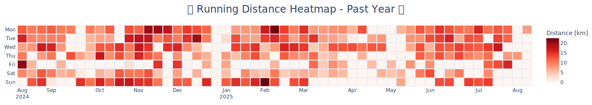

<!-- Credit to [rahuldkjain](https://github.com/rahuldkjain/github-profile-readme-generator) for the starting point of my readme. -->

<!-- ## Stefan Oberholzer -->

<h1 align="center">🫡 Welcome 🫡</h1>
<!-- <h3 align="center">A passionate Computer Engineer from South Africa</h3> -->

<!-- Walking Man GIF -->
<!--  -->

<!-- Email Address (Left) and Profile Views (Right) -->

    
    
    

 

I am <code>Stefan Oberholzer</code>, a Computer Engineer driven by a passion for solving complex engineering challenges. I am currently exploring opportunities in embedded systems or software development, with a strong focus on engineering problem-solving.
  
I have experience in a variety of programming languages, including Python for rapid development and C++ for low-level projects. I am eager to expand my skill set and take on new challenges, particularly in fields like embedded systems and software engineering.
  
I am also an avid runner. Below is a heatmap of my runs over the past year, built using the Strava API and updated daily.

<!-- Running Heatmap (Last 365 Days) -->

> Click on the heatmap for an interactive version.

Feel free to reach out to discuss new projects or opportunities.

    
    
    
    <!--  -->
    
    
    
    
    
    
    <!--  -->
    <!--  -->
    <!--  -->
    <!--  -->
    <!--  -->
    <!--  -->
    <!--  -->
    <!--  -->
    <!--  -->
    <!--  -->

<!-- Trophy Case

  
 -->

<h3 align="left">Languages and Tools:</h3>

 

 
 
 
 

 

 
 
 

 
 
 

<!-- Most Used Languages
Hide this until it is more diverse.

 -->

<!-- GitHub Stats
Hide this until it is more impressive.

&nbsp;
 -->
